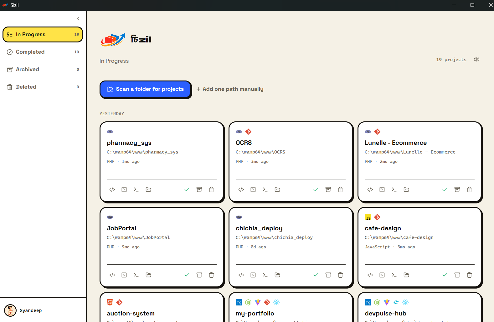

<div align="center">
  
  <h1>চিzil</h1>
  <p><strong>Bring order to your project chaos.</strong></p>
  <p>
    
    
    
  </p>
</div>

---

## What is Sizil?

Sizil is a **desktop project manager for developers** — built to run 100% offline on your Windows machine. No accounts, no cloud, no subscriptions. Just a fast, local app that keeps all your repositories organised in one place.

- Scan any folder and auto-detect your projects
- Track status: In Progress, Completed, Archived, Deleted
- Add tasks and checklists per project
- Launch VS Code, terminal, file explorer directly from the card
- Choose a custom avatar for your local profile
- Works completely offline — your data never leaves your machine

---

## Screenshot



---

## Download & Install

Go to the [**Releases**](https://github.com/Gyandeep09/sizil-app/releases) page and download the latest `Sizil_vX.X.X_x64-setup.exe`.

1. Run the installer
2. Windows may show a SmartScreen warning — click **More info → Run anyway**
3. Launch Sizil from your Start Menu or Desktop shortcut

> Sizil is free to download and use.

---

## Tech Stack

| Layer | Technology |
|---|---|
| Desktop shell | [Tauri v2](https://tauri.app) (Rust) |
| UI | React 18 + TypeScript |
| Styling | Tailwind CSS |
| Database | SQLite (via rusqlite, bundled) |
| Fonts | Syne, Space Grotesk, Noto Sans Bengali |

---

## Build from Source

> Prerequisites: [Node.js 20+](https://nodejs.org), [Rust stable](https://rustup.rs), [Tauri CLI](https://tauri.app/start/prerequisites/)

```bash
git clone https://github.com/Gyandeep09/sizil-app.git
cd sizil-app
npm install
npm run tauri dev
```

To build the Windows installer:

```bash
npm run tauri build
# Output: src-tauri/target/release/bundle/nsis/Sizil_*_x64-setup.exe
```

---

## Author

Made with ❤️ by **[Gyandeep09](https://github.com/Gyandeep09)**

This is an original idea and design — all credit belongs to the author.

---

## License

Copyright © 2025 Gyandeep09. All Rights Reserved.

See [LICENSE](LICENSE) for details.
